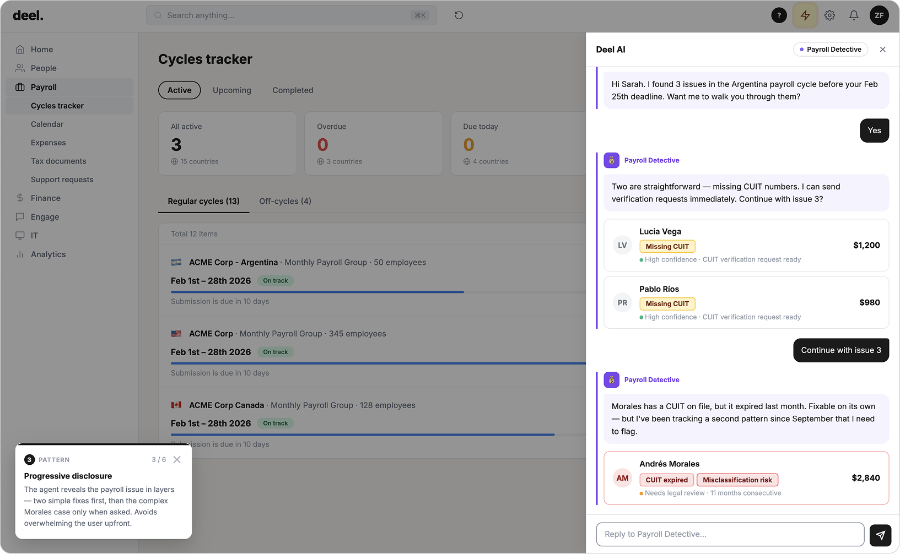
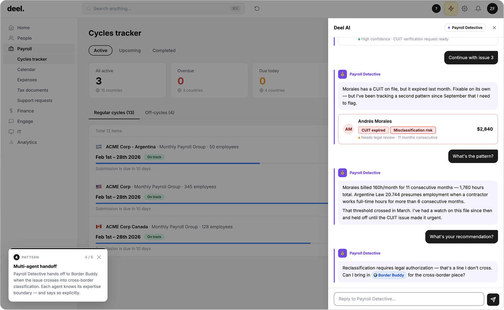

# Demo: Payroll Intelligence

> **Disclaimer:** The company name and branding shown in this prototype are used for design demonstration purposes only. This is an unsolicited concept exploration, not an official product of or affiliated with the named company.

---

A browser-based conversational AI prototype demonstrating how an intelligent payroll agent handles proactive anomaly detection, cross-border compliance, and multi-agent escalation in a global HR platform.

Video walkthrough available at [fromus.ca](https://fromus.ca). To see a live demo, reach out on [LinkedIn](https://www.linkedin.com/in/nevilleko/).

---

## The scenario

An HR manager at a global company opens their payroll dashboard. Before they ask a single question, Payroll Detective, one of the platform's specialized AI agents, has already detected three contractor classification issues in the Argentina payroll cycle, ahead of the February 25th submission deadline.

The conversation that follows moves through:

1. A proactive alert surfaced before the user asks
2. Two straightforward issues resolved with high confidence
3. A complex cross-border classification case requiring a specialist agent
4. A legal determination requiring human approval
5. An inline page update reflecting the outcome

No issue is buried. No action is taken without permission. No decision is made without the right expertise.

---

## Patterns demonstrated

| Pattern | Where it appears |
|---------|-----------------|
| [Proactive alerts](../patterns/01-proactive-alerts.md) | Toast notification surfaces Argentina issues before user opens the panel |
| [Context awareness](../patterns/02-context-awareness.md) | Agent knows cycle details, deadline, and contractor data upfront |
| [Trust calibration](../patterns/04-trust-calibration.md) | Confidence expressed per finding; high-confidence issues actioned, uncertain case escalated |
| [Progressive disclosure](../patterns/05-progressive-disclosure.md) | Two simple fixes first; Morales complexity revealed only after user confirms |
| [Multi-agent handoff](../patterns/06-multi-agent-handoff.md) | Payroll Detective hands to Border Buddy at the cross-border classification boundary |
| [Capability boundaries](../patterns/07-capability-boundaries.md) | "Reclassification requires legal authorization, that's a line I don't cross" |
| [Human-in-the-loop](../patterns/08-human-in-the-loop.md) | Two-option decision card before any payment moves |
| [Resolution confirmation](../patterns/10-resolution-confirmation.md) | Argentina payroll row updates inline; legal review status visible in the product |

---

## Workflow Screenshots

### Step 1: Proactive toast notification

*Payroll Detective monitors payroll cycles in the background and surfaces issues before the user notices. No query required.*

### Step 2: Trust calibration, contractor findings

*Each card shows the agent's confidence level explicitly, not just its answer. Users can evaluate the finding and decide whether to act, verify, or escalate.*

### Step 3: Progressive disclosure, the Morales case

*Issues are revealed in layers. Two straightforward fixes come first; the complex Morales case surfaces only after the user confirms they want to continue.*

### Step 4: Multi-agent handoff

*Payroll Detective hands off to Border Buddy when the issue crosses into cross-border classification. Each agent knows its expertise boundary and says so explicitly.*

### Step 5: Human-in-the-loop gate

*No payment moves without an explicit human decision. Options are presented, not assumed. The human stays in control of every consequential action.*

### Step 6: Inline page update, resolution confirmed

*After resolution, the Argentina payroll row updates in the background. The conversational layer and the product surface stay connected, no navigation required.*

---

## Technical implementation

- **Frontend:** Single-file HTML/CSS/JS browser prototype
- **Conversation engine:** State machine with mock sequences per scenario step
- **AI panel:** Sliding panel with agent chip, multi-agent state, and HITL card rendering
- **Annotation system:** Sequential annotation cards that auto-advance as the demo progresses, designed for live portfolio presentations
- **Backend (planned):** n8n webhook → Claude Sonnet 4.6 → Window Buffer Memory → Respond to Webhook
