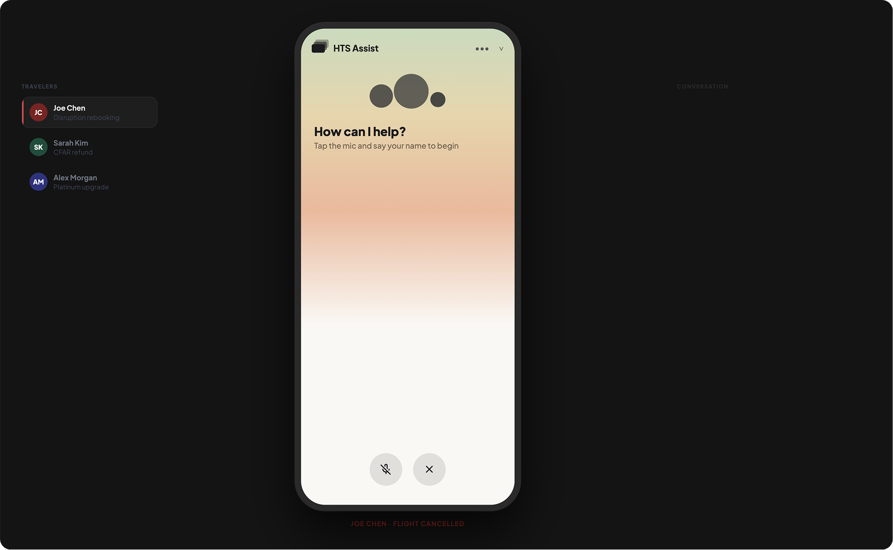
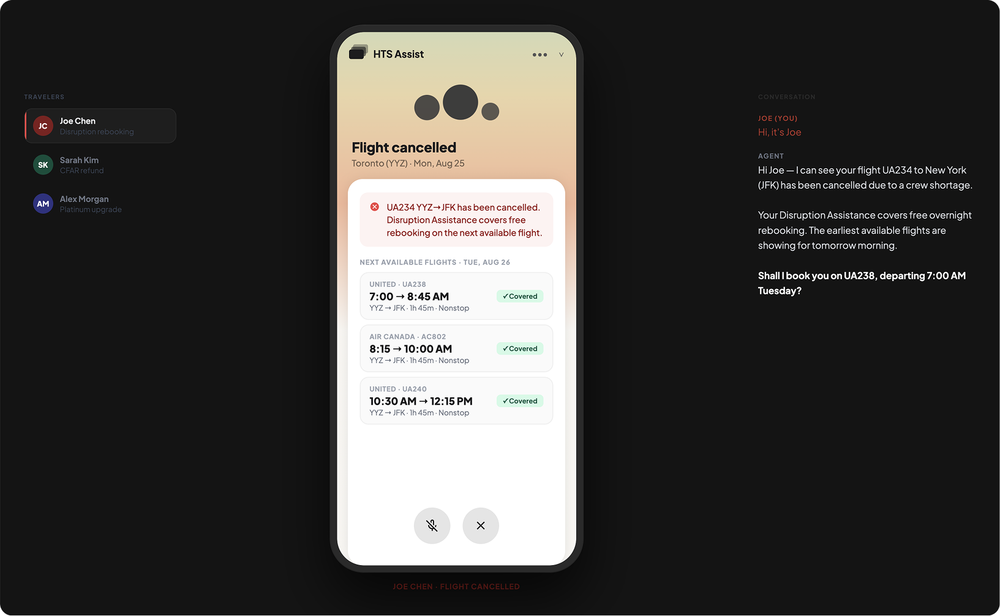
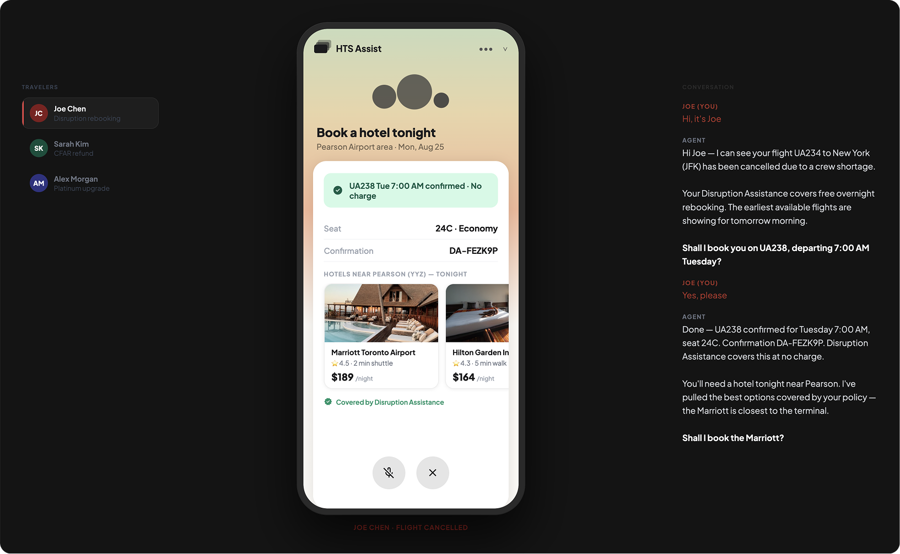
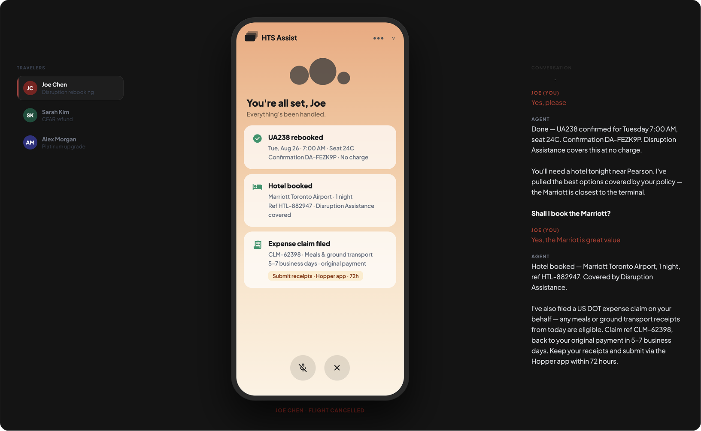
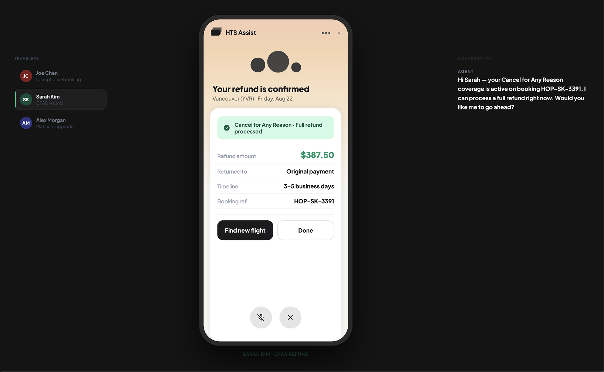
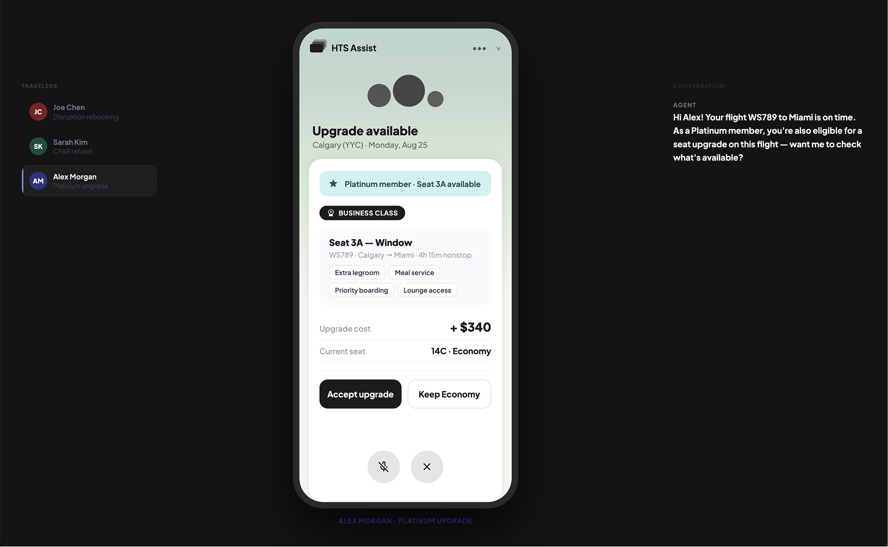
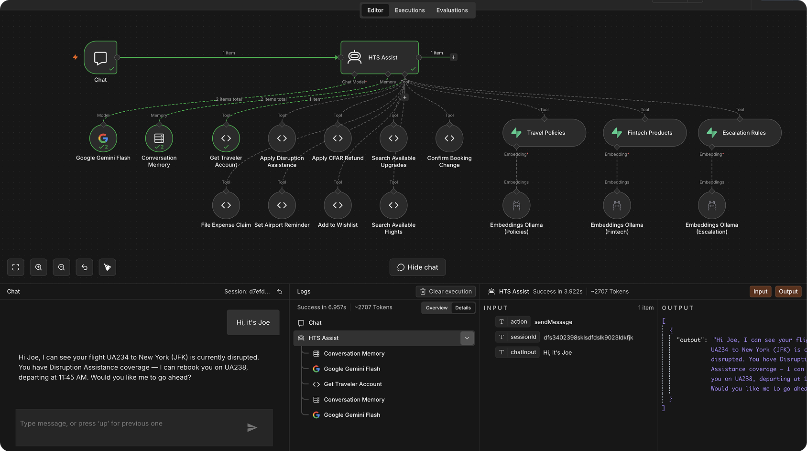
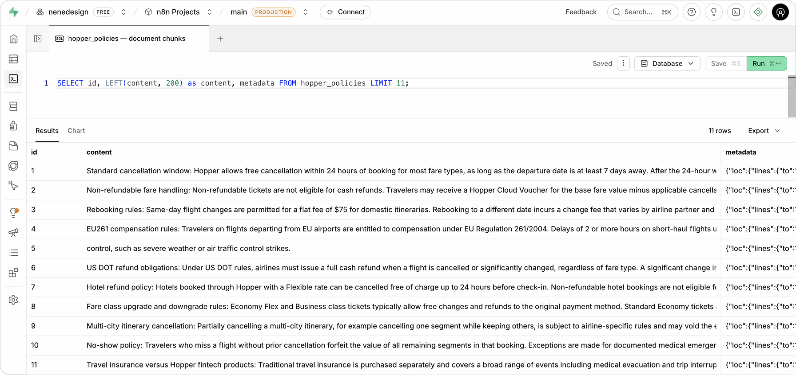

# Demo: Travel Disruption

> **Disclaimer:** The company name and branding shown in this prototype are used for design demonstration purposes only. This is an unsolicited concept exploration, not an official product of or affiliated with the named company.

---

A browser-based conversational AI prototype demonstrating how an agentic travel assistant handles flight disruption, CFAR refunds, and loyalty upgrades, from proactive alert to full resolution, in a single conversation.

Video walkthrough available at [fromus.ca](https://fromus.ca) *(coming soon)*. To see a live demo, reach out on [LinkedIn](https://www.linkedin.com/in/nevilleko/).

---

## The scenario

Three travellers. Three distinct situations. One agent that already knows each one's context before they speak.

- **Joe Chen**: flight UA234 to JFK cancelled due to crew shortage. Has Disruption Assistance coverage. Needs rebooking, overnight hotel, and expense claim.
- **Sarah Kim**: trip cancelled. Has Cancel for Any Reason (CFAR) coverage. Needs a full refund.
- **Alex Morgan**: Platinum member, flight on time. Eligible for a seat upgrade and lounge access before departure.

Each persona demonstrates a different facet of context-aware, action-first conversational AI. The agent does not ask the user to explain their situation. It already knows.

---

## Patterns demonstrated

| Pattern | Where it appears |
|---------|-----------------|
| [Proactive alerts](../patterns/01-proactive-alerts.md) | Agent surfaces disruption context the moment the user opens the chat |
| [Context awareness](../patterns/02-context-awareness.md) | Agent knows each traveller's booking, coverage type, and membership status upfront |
| [Action-first framing](../patterns/03-action-first-framing.md) | Every opening message leads with what the agent can do, not what it knows |
| [Autonomous chaining](../patterns/09-autonomous-chaining.md) | Joe's resolution: one confirmation triggers rebook → hotel → expense claim |
| [Resolution confirmation](../patterns/10-resolution-confirmation.md) | "You're all set, Joe", dedicated resolution screen with booking ref, hotel, and claim number |
| [Knowledge grounding](../patterns/11-knowledge-grounding.md) | Agent responses grounded in a RAG pipeline over policy and regulatory documents |

---

## Workflow Screenshots

### Step 1: Multi-persona selector

*Three travellers, three distinct situations. The agent knows each person's booking, coverage type, and status before they say a word.*

### Step 2: Context-aware opening, Joe Chen

*Joe's flight is cancelled. The agent surfaces his coverage and offers to rebook before he asks. Context is pre-loaded, not queried.*

### Step 3: Autonomous chain, Joe's resolution

*One confirmation triggers the full chain. Flight rebooked, hotel options surfaced, expense claim queued. The agent carries the load between decision points.*

### Step 4: Resolution confirmation, "You're all set, Joe"

*Dedicated resolution screen with all reference numbers visible. The conversation is over; the confirmation is permanent.*

### Step 5: Context-aware opening, Sarah Kim

*Sarah's CFAR coverage is already active. The agent offers a full refund immediately — no explanation of terms, no form to fill.*

### Step 6: Context-aware opening, Alex Morgan

*Alex's flight is on time. The agent surfaces his Platinum upgrade eligibility proactively and checks availability on request.*

---

## Technical grounding: context engineering and agentic RAG

Two mechanisms work together to make this demo intelligent rather than scripted.

### Context engineering: traveller profiles pre-loaded at session start

Each traveller's profile — flight details, booking reference, coverage type, and loyalty status — is assembled and injected into the agent's context before the conversation begins. This is what enables the agent to open with "Hi Joe, I can see your flight UA234 to JFK has been cancelled" rather than asking for a booking reference.

Context engineering is the mechanism behind [context awareness](../patterns/02-context-awareness.md) and [action-first framing](../patterns/03-action-first-framing.md). The agent doesn't ask because it already knows. Each persona has a distinct profile; switching personas loads a different context, producing a completely different opening.

### Agentic RAG: policy and regulatory retrieval

Agent responses on coverage eligibility, carrier rules, and product terms are grounded in a retrieval pipeline, not model memory. Policy documents, carrier regulations, and fintech product terms are embedded in a Supabase vector store. When a policy question arises, the agent retrieves the relevant passages and injects them into context alongside the traveller's profile.

The n8n workflow handles the full pipeline: webhook trigger → semantic search → Supabase vector store → context injection → Claude response. Responses are traceable to specific source documents, not attributed to model training.

### n8n RAG pipeline

### Supabase vector store

See [Knowledge grounding](../patterns/11-knowledge-grounding.md) for a full treatment of the RAG pattern.

---

## Technical implementation

- **Frontend:** Single-file HTML/CSS/JS browser prototype with three switchable personas
- **Conversation engine:** Mock sequences per persona with screen-tag rendering (`[[screen:xxx]]`)
- **Screen transitions:** CSS opacity transitions between named screens (disruption alert, hotel options, resolution)
- **Backend:** n8n webhook → Claude Sonnet 4.6 → agentic RAG over Supabase vector store
- **Knowledge base:** Policy documents and regulatory text embedded with semantic embeddings; retrieved per query
