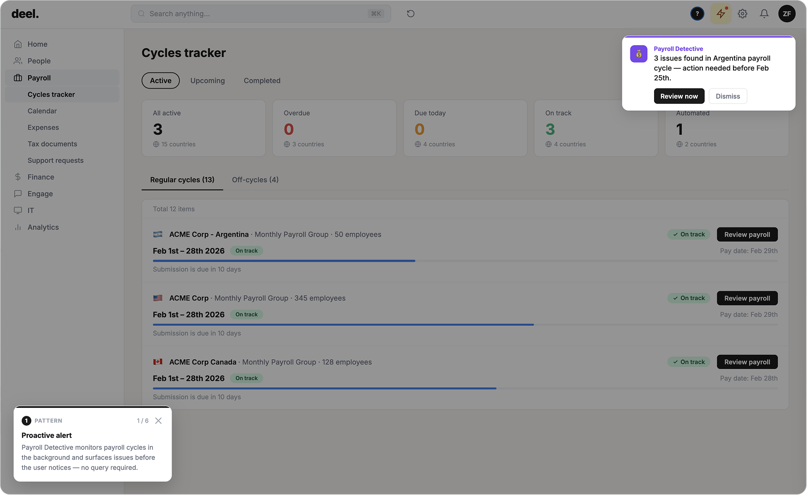

# Pattern 01: Proactive Alerts

## The problem

Most software is reactive by design. The user opens an app, finds a problem, asks for help. Conversational AI can do better, but only if the design allows it. An agent that waits to be asked is no smarter than a search bar. The value of an agent is that it can monitor, detect, and surface issues before the user even knows to look.

The failure mode is silence. An agent that has detected a problem but waits for the user to ask has failed at the one thing that makes it worth having.

## The pattern

**The agent monitors in the background and surfaces relevant issues proactively, without waiting for the user to initiate.**

A proactive alert has three parts:

1. **The trigger**: a condition the agent has detected that warrants user attention (an anomaly, a deadline, a risk, an opportunity)
2. **The framing**: a brief, specific statement of what was found and why it matters, without overwhelming the user with detail
3. **The invitation**: a clear next step the user can take, or the option to dismiss

The alert arrives at the right moment, through the right channel, with enough context to act on immediately. It does not require the user to navigate to a different screen or re-explain their situation.

**What makes it work:** The agent already has context. It knows the user's data, their role, their current state. The alert is specific because it is grounded in that context, not a generic notification, but a targeted observation.

## Seen in practice

### Payroll Intelligence: proactive payroll anomaly detection

The Payroll Detective agent monitors active payroll cycles in the background. When the Argentina payroll cycle surfaces three contractor classification issues ahead of the February 25th submission deadline, the agent proactively surfaces a toast notification, without the user opening the AI panel or asking a question.

The alert is specific: "3 issues found in Argentina payroll cycle, action needed before Feb 25th." It includes a direct action ("Review now") and a dismiss option. The user is not asked to find the problem. They are told what was found and given a path forward.

### Travel Disruption: flight cancellation alert

The HTS Assist agent surfaces the flight disruption the moment the user opens the chat, without the user reporting it. The agent already knows which flight was cancelled, the reason (crew shortage), and what coverage applies (Disruption Assistance). The opening message leads with the situation and the solution in the same breath.

<!-- Screenshot: Dreamer disruption alert screen -->
*[Screenshot: HTS Assist opening message, agent surfaces disruption context before user asks]*

## Research grounding

- **Google PAIR Guidebook, Pattern 7-8**: proactive design: surfacing information at the moment it is useful, not when the user thinks to ask for it. [pair.withgoogle.com/guidebook/patterns](https://pair.withgoogle.com/guidebook/patterns)

- **Deng et al. (2025), "Proactive Conversational AI: A Comprehensive Survey"**: systematic treatment of how agents initiate and guide conversations rather than purely reacting. *ACM Transactions on Information Systems.* [dl.acm.org/doi/10.1145/3715097](https://dl.acm.org/doi/10.1145/3715097)

- **ACL 2023 Tutorial: "Goal Awareness for Conversational AI: Proactivity, Non-collaborativity, and Beyond"**: argues that response quality alone is insufficient; agents must have goal awareness and initiative. [aclanthology.org/2023.acl-tutorials.1](https://aclanthology.org/2023.acl-tutorials.1/)

## Related patterns

- [Context awareness](02-context-awareness.md), proactive alerts only work if the agent already knows the user's situation
- [Action-first framing](03-action-first-framing.md), alerts should lead with what the agent can do, not just what it found
- [Progressive disclosure](05-progressive-disclosure.md), alerts should surface the summary; details come when the user engages
