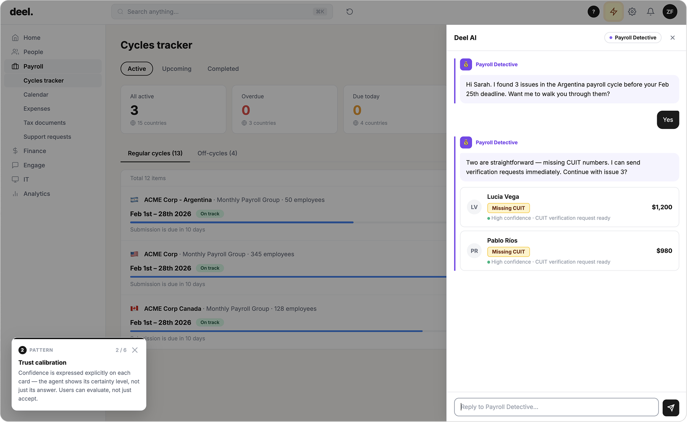

# Pattern 04: Trust Calibration

## The problem

AI systems are confidently wrong with the same tone they use when they are right. This is one of the most dangerous properties of language models, and one of the least addressed in conversational AI design. When an agent expresses everything with equal certainty, users cannot tell when to verify, when to push back, or when to escalate.

Overtrust is the predictable result. Users accept agent outputs without scrutiny because the design gives them no signal that scrutiny is warranted. In low-stakes contexts, this is tolerable. In payroll, compliance, healthcare, or finance, it is a liability.

## The pattern

**The agent expresses its confidence level explicitly, and adjusts its recommended actions based on that confidence.**

Trust calibration is not a disclaimer at the bottom of a response. It is an integrated part of how the agent communicates:

- **High confidence:** The agent states a finding directly and offers to act. "Two contractors are missing CUIT numbers. I can send verification requests now."
- **Moderate confidence:** The agent states the finding, names the uncertainty, and recommends verification before acting. "This pattern matches misclassification in 3 of the last 4 similar cases, but legal should confirm before payment moves."
- **Low confidence or outside scope:** The agent says so explicitly and escalates rather than guessing. "This requires a legal determination I'm not qualified to make."

Confidence is expressed through language, not through a score or a percentage. The agent's word choice, its recommended action, and its willingness to proceed all reflect its certainty level.

**What makes it work:** The agent has a defined confidence threshold that determines whether it acts, recommends verification, or escalates. This threshold is a design decision, not a default.

## Seen in practice

### Payroll Intelligence: confidence expressed per finding

The Payroll Detective surfaces three contractor issues in the Argentina payroll cycle. Each is presented with implicit confidence calibration:

- **Lucia Torres and Pablo Reyes (missing CUIT numbers):** High confidence. The agent offers to send verification requests immediately. No escalation needed.
- **Andrés Morales (classification pattern):** Moderate-to-low confidence on the legal determination. The agent states the risk clearly, potential $8,400 in back contributions under Argentina Law 20.744, but explicitly declines to make the legal call. Border Buddy provides deeper analysis, but still escalates to legal rather than resolving unilaterally.

The agent's confidence level determines its action recommendation at each step. This is visible in how it speaks, not in a UI element.

## Research grounding

- **Microsoft HAX Toolkit + Amershi et al. (CHI 2019)**: Guideline 6: "mitigate social biases" and Guideline 7: "support efficient invocation and dismissal." The broader framework addresses calibrated uncertainty as a core property of trustworthy AI. [microsoft.com/en-us/haxtoolkit](https://www.microsoft.com/en-us/haxtoolkit/ai-guidelines/)

- **Dubiel et al. (2022), "Conversational Agents Trust Calibration: A User-Centred Perspective"**: empirical study of how users form and update trust in conversational agents; covers design strategies for appropriate reliance. *ACM CUI 2022.* [dl.acm.org/doi/abs/10.1145/3543829.3544518](https://dl.acm.org/doi/abs/10.1145/3543829.3544518)

- **CHI 2024: "Empowering Calibrated (Dis-)Trust in Conversational Agents"**: controlled study of how disclaimer design and communicative style affect user trust. Found that language choices shape calibration more than explicit disclaimers. [dl.acm.org/doi/10.1145/3613904.3642122](https://dl.acm.org/doi/10.1145/3613904.3642122)

- **Anthropic Model Spec**: "calibrated uncertainty" as a core honesty norm: agents should have calibrated uncertainty in claims based on evidence and sound reasoning, and acknowledge uncertainty when relevant. [anthropic.com/research/claude-character](https://www.anthropic.com/research/claude-character)

## Related patterns

- [Capability boundaries](07-capability-boundaries.md), an agent that knows its confidence limits also knows when it has reached its capability boundary
- [Human-in-the-loop](08-human-in-the-loop.md), low confidence should trigger escalation, not a best guess
- [Progressive disclosure](05-progressive-disclosure.md), confidence calibration works with layered disclosure: high-confidence findings lead, uncertain ones follow
