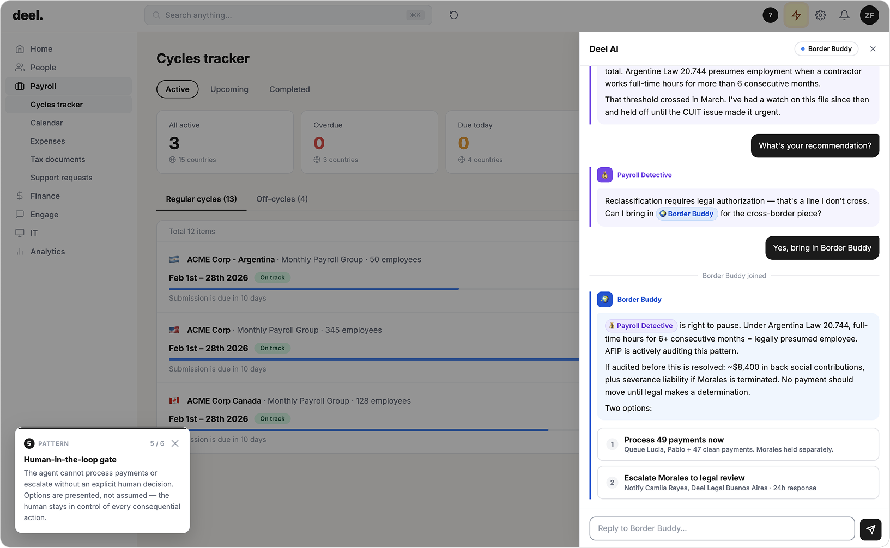

# Pattern 08: Human-in-the-Loop

## The problem

Agentic AI can move fast. That is the point. But speed without control is a risk, not a feature. An agent that acts without asking, processing payments, sending communications, escalating cases, removes the human from decisions they should be making. In regulated industries, this is a compliance failure. In any context, it erodes the trust that makes conversational AI worth using.

The naive fix, require human approval for everything, defeats the purpose of an agent. The design challenge is knowing which actions require a human gate and which do not. Not all actions are equal. Sending a verification request is not the same as processing a payroll cycle. Fetching a flight option is not the same as issuing a refund.

## The pattern

**The agent identifies consequential or irreversible actions and requires explicit human approval before proceeding, presented as a choice, not a confirmation.**

A human-in-the-loop gate has three properties:

1. **Triggered at the right threshold**: not every action, but every action that is consequential (financial, legal, reputational) or difficult to reverse
2. **Presented as options, not confirmations**: the user chooses between real alternatives; they are not rubber-stamping an agent decision
3. **Visually distinct**: the HITL card looks different from a normal conversation turn. The user should immediately understand this is a decision moment, not a message to read and scroll past

**What makes it work:** The threshold is defined in advance, not improvised. The agent knows which actions require a gate because that was specified at the system design level. The presentation makes the weight of the decision legible.

## Seen in practice

### Payroll Intelligence: two-option decision before payment moves

After Border Buddy completes the Morales analysis, no payment moves without an explicit human decision. Two options are presented:

- **Process 49 payments, hold Morales:** Queue 49 of 50 payments immediately; hold Morales's payment pending legal review. Keeps the cycle on track.
- **Escalate to legal:** Open a formal compliance ticket for all 50 workers; no payments move until legal makes a determination.

These are real tradeoffs with real consequences. The agent does not recommend one over the other. It presents the options, the stakes of each, and waits. The HITL card is visually distinct from normal conversation bubbles, bordered, structured, with explicit action buttons.

Only after the user selects an option does anything happen.

## Research grounding

- **Microsoft Research: Magentic-UI**: six HITL interaction mechanisms for agentic systems, including action guards (approval before consequential actions) and irreversibility detection. Direct implementation reference for HITL gate design. [microsoft.com/en-us/research/blog/magentic-ui](https://www.microsoft.com/en-us/research/blog/magentic-ui-an-experimental-human-centered-web-agent/) · [arxiv.org/abs/2507.22358](https://arxiv.org/abs/2507.22358)

- **OpenAI: "Practices for Governing Agentic AI Systems"**: human oversight for irreversible actions: agents should pause and verify with users when about to take actions that cannot be undone or that have significant real-world consequences. [cdn.openai.com/papers/practices-for-governing-agentic-ai-systems.pdf](https://cdn.openai.com/papers/practices-for-governing-agentic-ai-systems.pdf)

- **Anthropic: "Our Framework for Developing Safe and Trustworthy Agents"**: human control with autonomy: the agent should operate autonomously within defined bounds and require human approval at consequential decision points. [anthropic.com/news/our-framework-for-developing-safe-and-trustworthy-agents](https://www.anthropic.com/news/our-framework-for-developing-safe-and-trustworthy-agents)

- **ISO/IEC 42001:2023, AI Management Systems**: human oversight mechanisms as a system requirement: organizations must implement controls that allow humans to review, adjust, and override AI outputs, particularly for high-risk decisions. [iso.org/standard/42001](https://www.iso.org/standard/42001)

- **Salesforce: Responsible Agentic AI Guidelines**: human oversight retention: agentic systems should be designed so that humans remain in control of consequential decisions, with clear override mechanisms. [salesforce.com/news/stories/responsible-agentic-ai-guidelines](https://www.salesforce.com/news/stories/responsible-agentic-ai-guidelines/)

## Related patterns

- [Capability boundaries](07-capability-boundaries.md), HITL gates are the outer boundary: when the agent cannot proceed alone, it defers to a human
- [Trust calibration](04-trust-calibration.md), low confidence should trigger both a boundary acknowledgment and a HITL gate
- [Progressive disclosure](05-progressive-disclosure.md), by the time the user reaches the HITL gate, they have received enough context to make an informed decision
