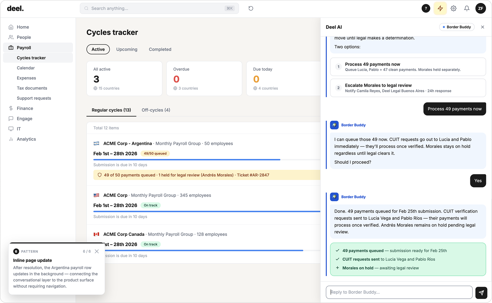

# Pattern 10: Resolution Confirmation

## The problem

Conversations end badly when the user is not sure if the problem is actually solved. The agent completes its tasks, reports back, and then... the conversation just stops. The user is left wondering: is the flight actually booked? Did the payment go through? Is the payroll cycle on track now?

Ambiguity at resolution is a trust failure. The user opened the conversation with a problem. If they cannot tell that the problem is closed, the agent has not finished its job, regardless of what it accomplished technically.

## The pattern

**The agent delivers a clear, specific signal that the issue is fully resolved, combining a conversational confirmation with a visible change in the product surface.**

Resolution confirmation has two layers:

1. **Conversational closure**: the agent states, explicitly, that the task is complete. Not "I've submitted that for you" but "Done, UA238 confirmed, seat 24C, ref DA-FEZK9P. Disruption Assistance covers this at no charge."
2. **Surface update**: the product state visibly changes to reflect the resolution. The payroll row updates. The booking confirmation appears. The user can see that something changed in the system, not just in the chat.

Both layers matter. The conversational confirmation is what the user reads. The surface update is what they remember. Together they close the loop completely.

**What makes it work:** The confirmation is specific, it includes the reference number, the coverage, the next step. Vague confirmations ("All done!") feel hollow. Specific confirmations feel real because they demonstrate that something actually happened in the underlying system.

## Seen in practice

### Travel Disruption: "You're all set, Joe"

After Joe's disruption is fully resolved, flight rebooked, hotel booked, expense claim filed, the screen transitions to a dedicated resolution view. "You're all set, Joe." The booking reference, hotel confirmation, and expense claim number are all visible. The tone shifts from operational to warm.

This is not a chat message. It is a screen state that exists specifically to signal closure. The user does not have to scan the conversation to confirm everything worked.

<!-- Screenshot: Dreamer, resolution confirmation screen "You're all set, Joe" -->
*[Screenshot: HTS Assist, resolution confirmation screen with booking ref, hotel confirmation, expense claim ref]*

### Payroll Intelligence: inline page update

After the user approves holding Morales's payment for legal review, the Argentina payroll row in the main product view updates in the background. The status badge changes from "On track" to "49/50 · Legal review." A legal note appears below the row: "49 of 50 payments queued · 1 held for legal review (Andrés Morales) · Ticket #AR-2847."

The user can see, in the product, not just in the chat, that their decision had an effect. The conversational layer and the product surface are connected.

## Research grounding

- **Nielsen Norman Group: "10 Guidelines for Designing AI Chatbots"**: completion signals: chatbots should clearly indicate when a task is complete, including what was done and any reference information the user may need. [nngroup.com/articles/ai-chatbots-design-guidelines](https://www.nngroup.com/articles/ai-chatbots-design-guidelines/)

- **Apple Human Interface Guidelines: Siri**: completing requests in-place: the system should confirm completion within the interface where the user initiated the task. [developer.apple.com/design/human-interface-guidelines](https://developer.apple.com/design/human-interface-guidelines/)

- **Amershi et al. (2019), "Guidelines for Human-AI Interaction"**: Guideline 14: "make clear what the system can and cannot do" extends to resolution: the system must make clear when it has done what it said it would do. *CHI 2019.* [dl.acm.org/doi/10.1145/3290605.3300233](https://dl.acm.org/doi/10.1145/3290605.3300233)

## Related patterns

- [Autonomous chaining](09-autonomous-chaining.md), resolution confirmation is the end state of a chain; it signals that all sub-tasks are complete
- [Human-in-the-loop](08-human-in-the-loop.md), after the human makes a decision, resolution confirmation shows the outcome of that decision in the product surface
- [Proactive alerts](01-proactive-alerts.md), the loop opened with a proactive alert; resolution confirmation is what closes it
