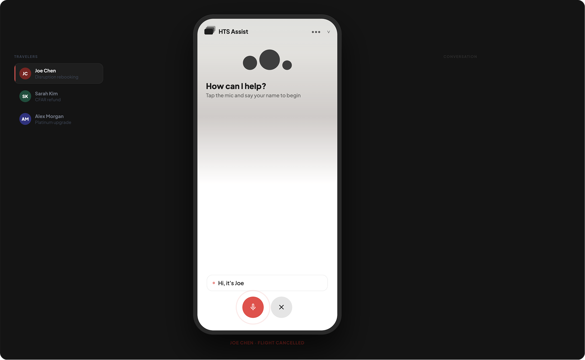

# Pattern 16: Conversation Repair

## The problem

Conversations break. A user says something the agent does not recognize. They go silent. They phrase a request in a way that matches nothing in the intent library. In a voice agent, they speak over the response before it finishes. These are not edge cases. They happen in every production deployment.

The naive fix is to loop: ask the same question again, wait for a better answer. It does not work. Users who did not understand the first prompt will not understand the repetition. Users who are frustrated become more frustrated. After two or three unrecognized turns, most users abandon the conversation entirely.

The cost of a bad repair sequence is not just one lost conversation. It is a user who does not come back.

## The pattern

**The agent detects conversational breakdowns, names them without blaming the user, and triggers a graduated recovery sequence that escalates toward a human exit.**

A repair sequence has four properties:

1. **Graduated response**: the first failure prompts a clarification attempt. The second offers alternatives or rephrasing. The third triggers escalation. Each step is defined in advance, not improvised.
2. **Blame-free acknowledgment**: the agent owns the breakdown. "I did not catch that" not "that is not a valid response." The user is never at fault for how they speak.
3. **Voice-specific handling**: for voice agents, silence (NoInput) and unrecognized speech (NoMatch) are distinct failure types that require different recovery messages. A user who went silent is not the same as a user who said something unexpected.
4. **Defined exit**: after a set number of failures, the agent stops trying to recover and offers a real exit: a live agent, a callback, or a graceful session close with next steps. The conversation ends on terms the user controls.

**What makes it work:** The exit path is built into the design from the start, not added when everything else fails. A conversation that ends gracefully preserves more trust than one that loops until the user hangs up.

## Seen in practice

*Demonstrated in: [Travel Disruption](../demos/travel-disruption.md)*

### Dreamer: voice input and recovery handling

The Dreamer demo includes a voice input simulation layer for the Joe Chen flow. When voice recognition fails or the agent receives an unexpected utterance mid-rebooking, the recovery sequence surfaces a clarification prompt tied to the active step in the conversation, not a generic "I did not understand." If the failure repeats, the agent offers to continue by text or connect to a live agent.

The repair behavior is consistent regardless of where in the flow the breakdown occurs. The agent does not lose the conversational context while it recovers.

## Research grounding

- **Google Conversational Agents, NoMatch and NoInput Event Handlers**: platform-level implementation of conversational repair. NoMatch fires when user input does not match any defined intent; NoInput fires when no input is received within the timeout window. Both trigger configurable handler sequences with escalation to a live agent after repeated failures. [cloud.google.com/dialogflow/cx/docs/concept/handler](https://cloud.google.com/dialogflow/cx/docs/concept/handler)

- **Microsoft HAX Toolkit, G9: "Support efficient invocation and dismissal"**: users should always have a clear path to exit or escalate when an interaction is not working. The escape path should be available after any failure, not only after repeated ones. [microsoft.com/en-us/haxtoolkit](https://www.microsoft.com/en-us/haxtoolkit)

- **Google PAIR People + AI Guidebook, "Help users course-correct"**: when AI misunderstands, the correction experience matters as much as the original interaction. Repair prompts should reduce friction, not add to it. The system should offer alternative ways to proceed, not repeat the failed prompt. [pair.withgoogle.com/guidebook](https://pair.withgoogle.com/guidebook)

- **Jurafsky & Martin, "Speech and Language Processing" (3rd ed.), Chapter 26: Conversational Agents**: covers clarification subdialogues, repair initiation, and the design of grounded dialogue systems. Grounding failure is the theoretical basis for NoMatch and NoInput repair sequences. [web.stanford.edu/~jurafsky/slp3](https://web.stanford.edu/~jurafsky/slp3/)

## Related patterns

- [Testing and evaluation](13-testing-and-evaluation.md), repair scenarios are high-priority test cases; every repair path should have a dedicated test covering the full graduated sequence
- [Digression handling](12-digression-handling.md), a digression that produces a NoMatch event may look like a breakdown but is actually a topic shift; the two should be distinguished at the intent level
- [Human-in-the-loop](08-human-in-the-loop.md), repeated repair failures are a signal that the conversation has exceeded the agent's capability; escalation is the right exit
